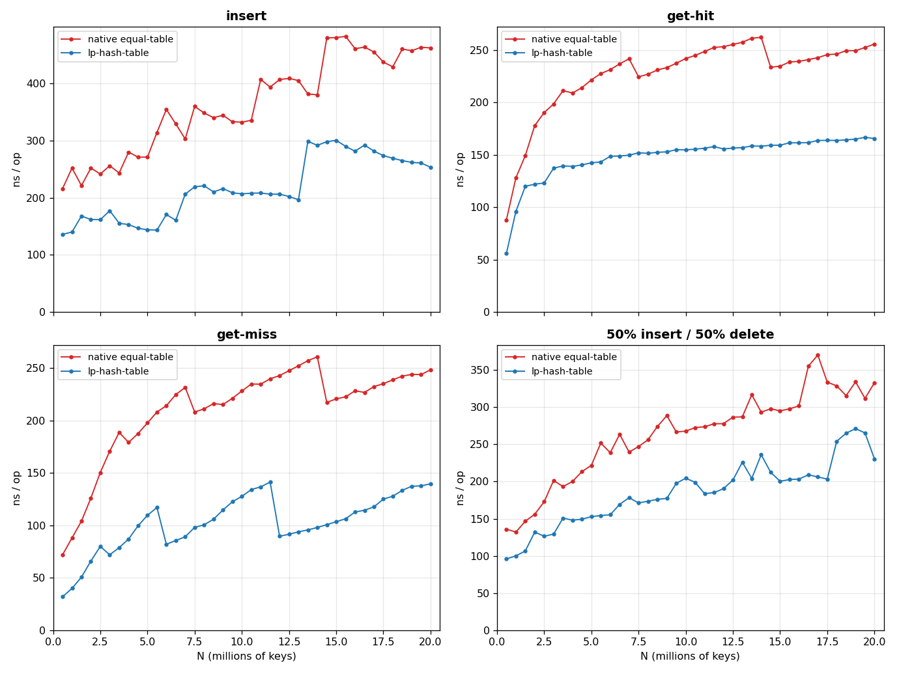

#+TITLE: Pretty Fast™ Linear-Probing Hash Tables and Sets
This library aims to provide hash tables with nearly highest throughput if:
- You want to preserve insertion order; or your keys/values are Lisp objects, in
  that case you almost always want to preserve insertion order, because
  insertion order ≈ allocation order ≈ address order and GC scanning the table
  will thank you
- Your hash function does not suck
- Your table is really large, much larger than Last Level Cache (LLC)

This library is still pretty fast if your table is small, but some SIMD Swiss
table could be faster. For my workload, my SIMD F14vector prototype ranges from
as fast or =9%= slower compared to =lp-hash-table=, while being much more complex.

This software is in Public Domain.
* How fast
Linux SBCL 2.6.3 with 24GB heap on Xeon E5-2640 v4 (25MB LLC). 4-element fixnum
list keys (because that's why we write Lisp), =lp-hash-table= uses a custom hash
function, comparing with stock =equal= hash table:

* Usage

=define-hash-table= / =define-hash-set= defines a table type for a given =hash-fn= and
=test-fn=, interning the operations (=make-NAME=, =NAME-get/put/rem/clear/count=,
=map-NAME=) into the current package. If =hash-fn= and =test-fn= is declared =inline=,
they will be inlined.  If operations such as =NAME-get= is declared =inline= before
using =define-hash-table= / =define-hash-set=, they will be inlined.

#+begin_src lisp
(ql:quickload :lp-hash-table)
(use-package :lp-hash-table)              ; nickname :LPHT

(define-hash-table str-table (lambda (s) (sxhash (the string s))) equal)

(defvar *h* (make-str-table))             ; &key size load-factor kv-size
(str-table-put "foo" 42 *h*)              ; => 42        insert/update, returns the value
(str-table-get "foo" *h*)                 ; => 42, T     (values value present-p)
(str-table-get "bar" *h* :none)           ; => :none, NIL   default on miss
(str-table-count *h*)                     ; => 1
(map-str-table (lambda (k v) (print (list k v))) *h*)  ; iterates in insertion order
(str-table-rem "foo" *h*)                 ; => T

(declare (inline fxhash))
(defun fxhash (x)
  (declare (type fixnum x))
  (logand (* x 2654435769) most-positive-fixnum))

(declaim (inline fixnum-set-get fixnum-set-put)) ; These can be inlined when used
(define-hash-set fixnum-set fxhash eq)     ; FXHASH is inlined

(defvar *s* (make-fixnum-set))
(fixnum-set-put 7 *s*)                     ; => 7        ;returns the stored key
(fixnum-set-get 7 *s*)                     ; => 7, T
(fixnum-set-get 9 *s*)                     ; => NIL, NIL
(map-fixnum-set #'print *s*)
#+end_src

* How it works

The hash table stores a =PROBE= vector of type =(simple-array (unsigned-byte 32))=
that interleaves =(32-bit-hash, index + 1)=. 0 in the index slot marks an empty
entry. =PROBE= has power-of-two size and implements linear-probing with
backward-shift on deletion (no tombstones). =index= points to another =KV= vector,
which interleaves key and values for =define-hash-table= and stores only keys for
=define-hash-set=. Entries in =KV= vector mirrors insertion order, and new element
are appended to =HWM= (high water mark). Deleted entries are marked by
=+delete+=. When =KV= is full, =*-COMPACT= is called to remove all deleted
entries. The =index= indirection has two benefits:
- =map-*= preserve insertion order
- =PROBE=, a nightmare for GC if we store boxed keys/values there, do not need to
  be scanned; =KV= is scanned and is GC-friendly

Note: the above assume =*probe-bits*= is 32. On platform where =fixnum= is
shorter this will be decreased automatically (like 32-bit
platforms). You can also control this via the =:probe-bits= option.

* Knobs

There isn't one single fastest hash table, so the library provides a number of knobs:
- =define-hash-set= to save space if you don't need to store values
- pass =:store-hash t= to speed up compaction if your hash function is expensive
  and your workload is delete-heavy; otherwise =:store-hash nil= to save space.
- pass =:optimize (speed (safety 0))= to become maybe faster or/and heap-corrupted
- =:probe-bits= defaults to =*probe-bits*=, which is a reasonable guess
  (32-bit if possible, or shorter if =fixnum= is short).
- The constructor =make-*= defined by the =define-hash-table= or =define-hash-set=
  macro takes option:
  - =:size= initial size
  - =:load-factor= default to 0.7
  - =:kv-size= control frequency of compaction, =KV= vector has size
    =probe-size*load-factor*kv-size=, default to 1.5.

Ping me if you wish for specialized key/value type or whatever else. The library
currently serves my use case (hash-consing) well, but I'm happy to help with
yours.

